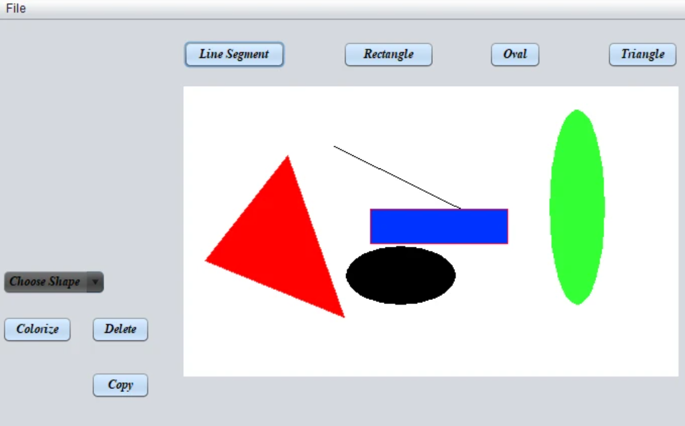

# 🎨 Mini-Paint Application



**Mini-Paint** -  Unleash Your Creativity with Geometric Art! 🖌️

## 📝 Overview

Mini-Paint is a Java-based desktop application that allows users to create, edit, and manipulate various geometric shapes. Whether you're designing simple shapes or complex compositions, Mini-Paint provides the tools to create, color, resize, and transform your objects with ease.

## ✨ Features

* ✏️ Create Shapes: Draw various geometric shapes like rectangles, circles, triangles, and more.
* 🔄 Edit and Transform: Resize, rotate, and move your shapes to achieve the perfect design.
* 🗑️ Delete Shapes: Easily remove shapes that you no longer need in your design.
* 🎨 Coloring: Apply colors to your shapes to bring your artwork to life.
* 💾 Save and Load: Save your creations and load them anytime to continue working.


## 🛠️ Tech Stack

* ☕ Programming Language: Java
* 🖥️ GUI Framework: JavaFX for an intuitive and user-friendly interface
* 🗃️ File Handling: Java I/O for saving and loading your designs

## 🚀 Getting Started

### 📋 Prerequisites
* ☕ JDK 8 or later
* 💻 A Java IDE (like IntelliJ IDEA, Eclipse, or NetBeans)

### ⚙️ Installation
1. Clone the repository:
   ```bash
   git clone https://github.com/youssefwaheedd/miniPaint.git
2. Navigate to the project directory:
   ```bash
   cd mini-paint
   
### Running the Project
Open the project in your IDE:

* Open your Java IDE.
* Import the project as a Maven/Gradle project (depending on your setup).
Build and run the application:

* Use your IDE’s run configuration to start the application.
* Alternatively, you can use Maven/Gradle commands to build and run the project.


### 🎨 How to Use

  * Creating Shapes: Select a shape from the toolbar and then enter the starting coordinates of it.
  * Editing Shapes: Click on a shape to select it, then use the resize handles to adjust its size. You can also drag the shape to move it.
  * Deleting Shapes: Select a shape and press the delete button or use the delete key.
  * Coloring: Choose a color from the color palette and apply it to your selected shape.
  * Saving and Loading: Save your design as a file and load it later to continue editing.


### Contributing
Contributions are welcome! Please fork this repository and submit a pull request with your improvements or bug fixes.


### Contact

For any questions or suggestions, feel free to reach out:

- **Email:** [youssefwaheed@gmail.com](mailto:youssefwaheed@gmail.com)
- **LinkedIn:** [Youssef Waheed](https://linkedin.com/in/youssefwaheed)
